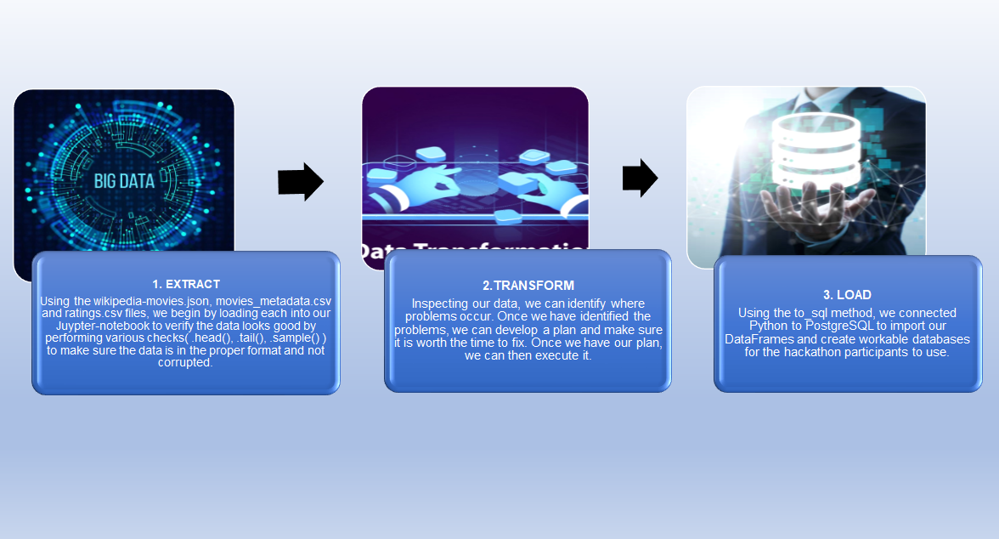

# Movies-ETL
The main task of this project is creating an ETL pipeline from raw data, Extracting and Transforming it until Load to a SQL database.

## Overview:
Amazing Prime loves the dataset and wants to keep it updated daily. Amazing Prime requests to develop an algorithm to predict which low budget movies will become popular so they can buy the streaming rights for those movies. to develop the algorithm, first we needed to create an automated pipeline that takes in new data, and then performs the appropriate transformations, and loads the data into existing tables. was necessary refactors the code to create a function that takes in the three files Wikipedia data, Kaggle metadata, and the MovieLens rating data and performs the ETL process and finally added the data to a PostgreSQL database.

### Fig.1 ETL process 

  
